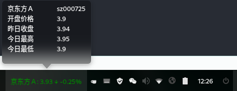

# dde-sys-stock-monitor
## deepin dock股票监控插件，手动添加股票代码，监控股票状态，支持自动切换股票，和手动切换
### 参考了https://github.com/linuxdeepin/dde-dock/blob/master/plugins/plugin-guide/plugins-developer-guide.md

### 接口采用的是http://hq.sinajs.cn/list=sz000725




### 使用方式：

- 在用户目录下新建文件stockCodes（文件名需保持一致）文件内容如下

  ```
  sz000063
  sh601236
  sh603369
  sh601390
  sz000040
  sz000725
  sz002603
  sh603885
  sz300597
  sz000876
  ```

- 安装相关依赖，执行build.sh编译并安装

本人是搞java的，qt和c++也是现学现用的，如代码上有啥不足和bug的，还请各位大佬指出，感谢。